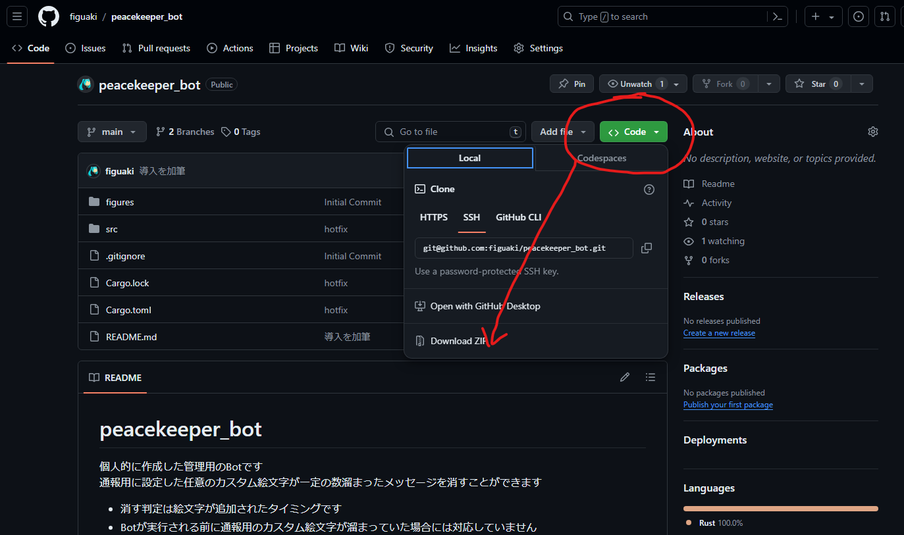
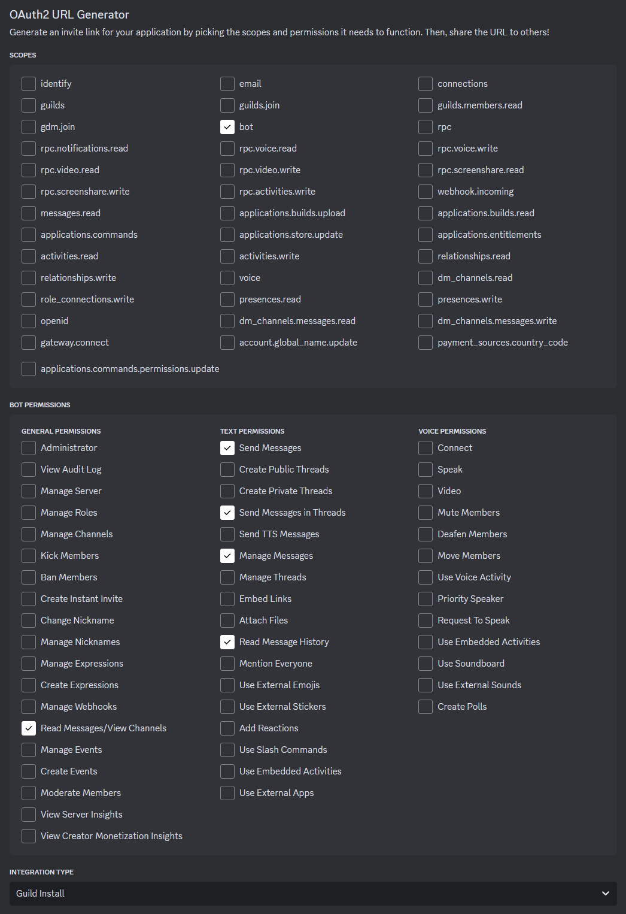
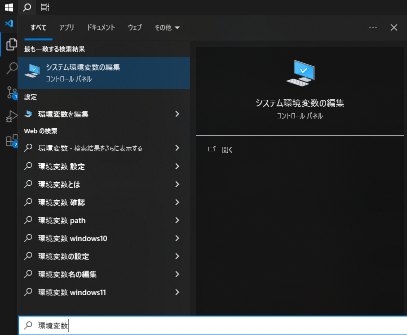
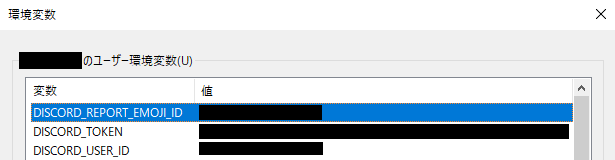
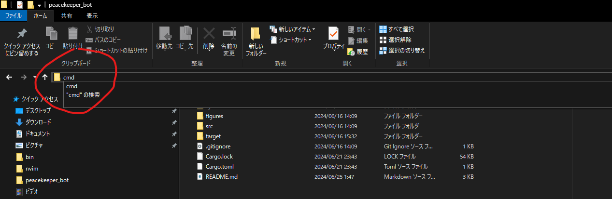
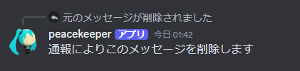

# peacekeeper_bot

個人的に作成した管理用のBotです  
通報用に設定した任意のカスタム絵文字が一定の数溜まったメッセージを消すことができます    
+ 消す判定は絵文字が追加されたタイミングです  
+ Botが実行される前に通報用のカスタム絵文字が溜まっていた場合には対応していません  
+ 自分のサーバではスレッドの作成を許可していないため，スレッド内のメッセージの削除に対応しているかは未知数です

## 実行する前に
### 0. このプログラムをダウンロードして任意の場所に展開してください．
  

### 1. このプログラムはrustで書かれています．rustの実行環境をインストールしてください．
> https://www.rust-lang.org/ja/tools/install

### 2. discordのbot開発ページでBotのトークンなどを取得＆Botをサーバに招待してください．  (自分は以下のページを参考にしました．)
> https://zenn.dev/t4t5u0/articles/cd731e0293cf224cb4dc

Botのpermissionはメッセージの送信&閲覧&管理を許可してください    
InstallはGuild Installにしました  

### 3. 以下の環境変数を設定してください  

+ DISCORD_TOKEN → 上記で設定したDISCORDBOTのTOKEN  
+ DISCORD_REPORT_EMOJI_ID → 通報用カスタム絵文字のID(Unicode絵文字には対応していません)  
+ DISCORD_USER_ID → 通報用BOTの有効無効を切り替えられるDISCORDユーザをIDで指定  

※上記の内discordのカスタム絵文字idとユーザidは以下のように適当なテキストチャンネルに`\`を先頭に付与した投稿を行うことで確認することが可能です．

+ 絵文字のidの表示: `\ここにカスタム絵文字を入力`  
+ ユーザidの表示: `\@ここにユーザ名(not表示名)を入力`

## 起動コマンド
上記手順を踏んだ上で以下を実行してください  
ダウンロードしたプロジェクトに移動してコマンドプロンプト(windows)，ターミナル(Linux, mac)を開く

コマンドプロンプト(windows)，ターミナル(Linux, mac)で以下のコマンドを入力して実行してください．

`cargo run --release`

起動したら適当な投稿にDISCORD_REPORT_EMOJI_IDで指定した絵文字でリアクションすると，コマンドプロンプト(windows)，ターミナル(Linux, mac)にログが出力されます.  
またDISCORD_USER_IDで指定したユーザが適当なテキストチャンネルで`cq_cq`と投稿するとbotが反応を返します．

## 仕様：  
+ DISCORD_USER_IDで指定したユーザが特定のキーフレーズ(デフォルト:wake_up)を含んだメッセージを投稿するとBotの有効無効が切り替わります  
+ Botが有効な状態で上記で指定されたカスタム絵文字が一定回数(デフォルト7個)以上押されるとBotが投稿に削除する旨の返信を送った後当該の投稿を消します  
+ バグがあるかもしれません．調子の悪い時はプログラムを終了(ctrl+c)して上記コマンドで再起動してください

一応，MIT Licenceです